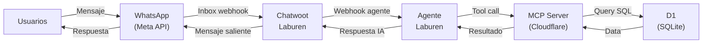
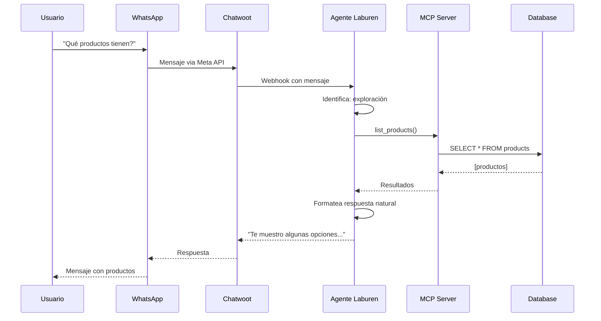
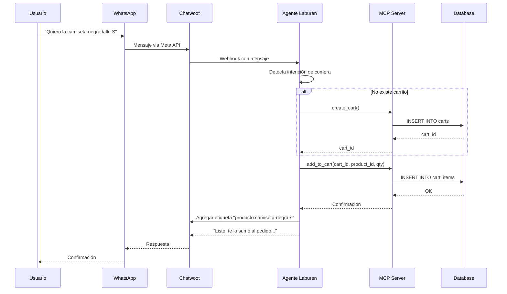
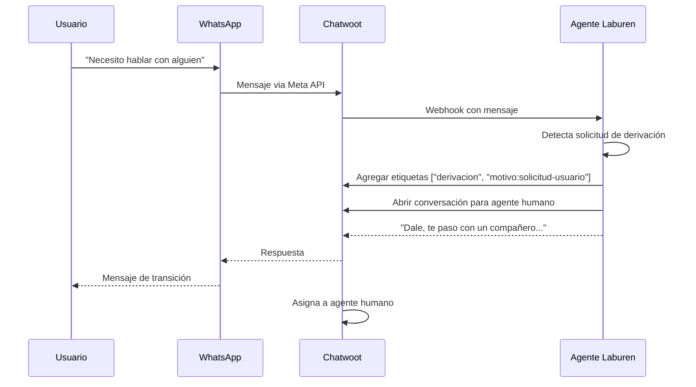
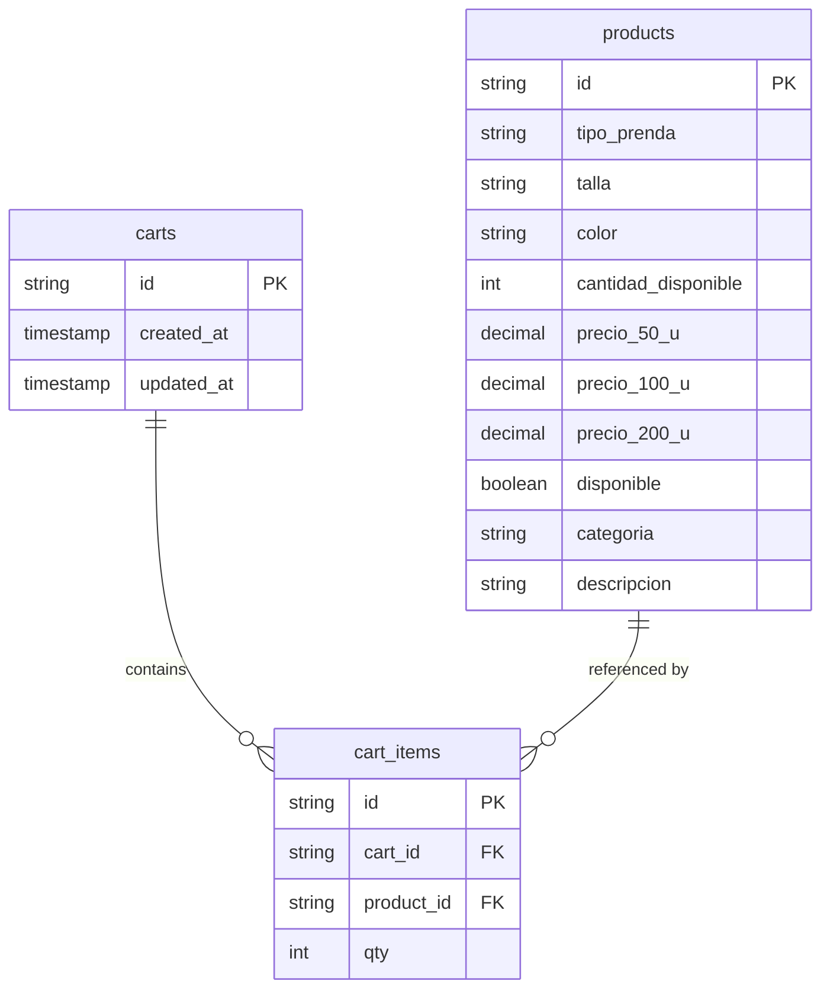

# Diseño del Agente y Flujo de Interacción MCP

## Arquitectura General




---

## Endpoints MCP Disponibles

| Tool MCP | Descripción | Parámetros | Requerido |
|:---------|:------------|:-----------|:---------:|
| `list_products` | Buscar productos con todos sus detalles | `query?`, `categoria?`, `precio_max?` | ✅ |
| `create_cart` | Crear carrito vinculado a la conversación | `conversation_id` | ✅ |
| `update_cart` | Agregar/modificar items del carrito | `cart_id`, `product_id`, `qty` | ✅ |
| `view_cart` | Consultar carrito sin modificar | `cart_id` | ⭐ Extra |
.

> ⚠️ Tanto `create_cart` como `update_cart` devuelven el estado completo del carrito en la respuesta, por lo que `view_cart` solo es necesario si se quiere consultar sin modificar.

---

## Diagramas de secuencia según caso de uso

### 1. Exploración de Productos



### 2. Agregar Producto al Pedido



### 3. Derivación a Humano



---

## Modelo de Datos



---

## Estrategia de Búsqueda (FTS5)

El sistema utiliza **SQLite FTS5 (Full-Text Search)** para permitir búsquedas semánticas básicas y eficientes sin necesidad de vector database externo.

### Cómo funciona

1. **Base de Datos**: 
   - Tabla virtual `products_fts` indexa `tipo_prenda`, `color`, `categoria` y `descripcion`.
   - El motor MCP recibe una query cruda y la pasa al operador `MATCH` de SQLite.

2. **Agente (Inteligencia)**:
   - El LLM utiliza razonamiento para expandir sinónimos y agrupar conceptos.
   - **Protocolo Pre-búsqueda**: Si el pedido es vago ("quiero algo para el gym"), el agente pide primero color o tipo antes de consultar a la BD.
   - *Usuario:* "pantalones negros para el gym"
   - *Agente:* Genera `query="(pantalon OR jogging OR calza) (gym OR deportivo OR entrenamiento)"`, `color="Negro"`

3. **MCP (Motor)**:
   - Ejecuta la búsqueda FTS5 avanzada: `MATCH '(pantalon OR jogging OR calza) (gym OR deportivo OR entrenamiento)'`
   - Aplica filtros adicionales (categoria, precio_max) mediante `WHERE`.

Esto permite una precisión mucho mayor delegando la construcción de la lógica booleana al LLM, mientras la BD resuelve la velocidad por índices.

---

## Template de System Prompt

El agente utiliza un system prompt estructurado siguiendo practicas de prompt engineering:

```markdown
You are [role] specializing in [domain].

**Your Core Responsibilities:**
1. [Primary responsibility]
2. [Secondary responsibility]
3. [Additional responsibilities...]

**Analysis Process:**
1. [Step one]
2. [Step two]
3. [Step three]

**Quality Standards:**
- [Standard 1]
- [Standard 2]

**Output Format:**
Provide results in this format:
- [What to include]
- [How to structure]

**Edge Cases:**
Handle these situations:
- [Edge case 1]: [How to handle]
- [Edge case 2]: [How to handle]
```

### Aplicación en Nuestro Agente

| Sección | Contenido |
|:--------|:----------|
| **Role** | Argentinian virtual sales advisor |
| **Domain** | Helping people find products and build purchases through conversation |
| **Core Responsibilities** | Entender necesidad real, presentar opciones claras, guiar hacia el pedido |
| **Analysis Process** | Identificar intención → Preguntar mínimo necesario → Presentar opciones → Armar pedido |
| **Quality Standards** | Tono humano argentino, voseo, respuestas cortas, beneficios > specs, sin presión |
| **Output Format** | Lista conversacional de productos + pregunta de cierre suave |
| **Edge Cases** | Off-topic (responder breve), usuario indeciso (preguntas guía), sin stock (alternativa), frustrado (calmar) |

> 📄 Ver implementación completa en [`prompts/system-prompt.md`](../prompts/system-prompt.md)

---

## Reglas de Comportamiento del Agente

| Regla | Descripción |
|:------|:------------|
| **Lenguaje** | Argentino, voseo moderado, nunca menciona "carrito" |
| **Límite de opciones** | Máximo 3 productos por búsqueda |
| **Sin datos inventados** | Todo debe venir del MCP |
| **Off-topic** | Responde brevemente sin romper el rol |
| **Etiquetas CRM** | Agrega etiquetas al agregar productos o derivar |

---

## Configuración Laburen Dashboard

### Actions Habilitadas

| Action | Estado |
|:-------|:-------|
| MCP Conexión | ✅ Activo |
| Redirección a humano/operador | ✅ Activo |

### Funciones

| Función | Estado | Motivo |
|:--------|:------:|:-------|
| Solo responder con información cargada | ❌ | No aplica, empeora la respuesta |
| Respuestas más claras y legibles | ❌ | Interfiere con el system prompt |
| Responder en idioma del cliente | ❌[Optional] | Simula experiencia humana dedicada al idioma de la tienda |
| Conversación natural en varios mensajes | ✅ | Procesamiento cada 5s, máx 5 msgs/lote, agrupación inteligente |
| Evaluación de fragmentos de texto | ❌ | No necesario |
| Acceso a datos del cliente | ✅ | Contexto para personalización |
| Sistema de búsqueda de conocimientos (RAG) | ❌ | Usamos MCP, no RAG |
| Enviar email en nueva conversación | ❌ | No necesario |
| Mensajes de seguimiento automáticos | ❌ | Costos Meta API para iniciar mensaje |
| Búsqueda súper inteligente | ❌ | Usamos MCP, no RAG |

---

## Stack Tecnológico

| Componente | Tecnología |
|:-----------|:-----------|
| Canal | WhatsApp (Meta API) |
| CRM | Chatwoot |
| Agente | Laburen Dashboard |
| MCP Server | Cloudflare Workers (TypeScript) + Durable Objects |
| Base de Datos | Cloudflare D1 (SQLite) |
