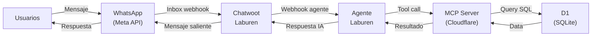
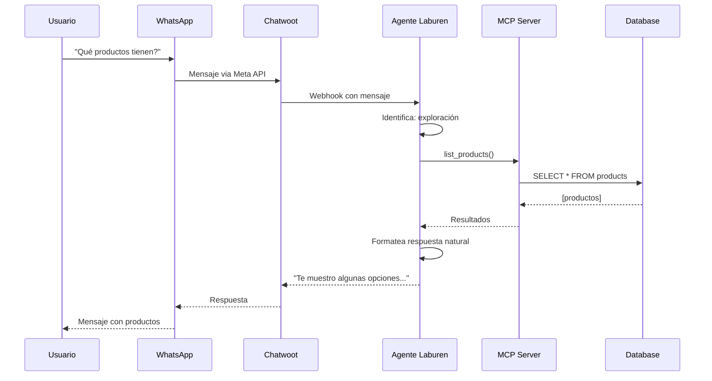
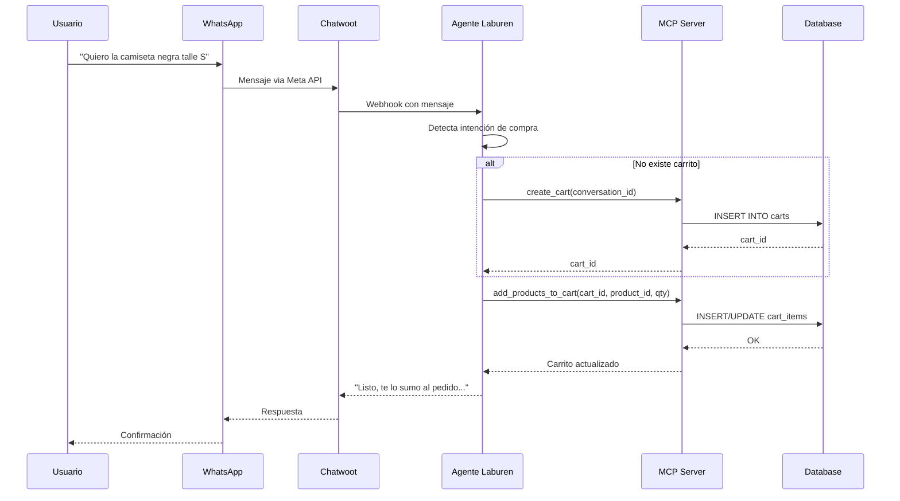
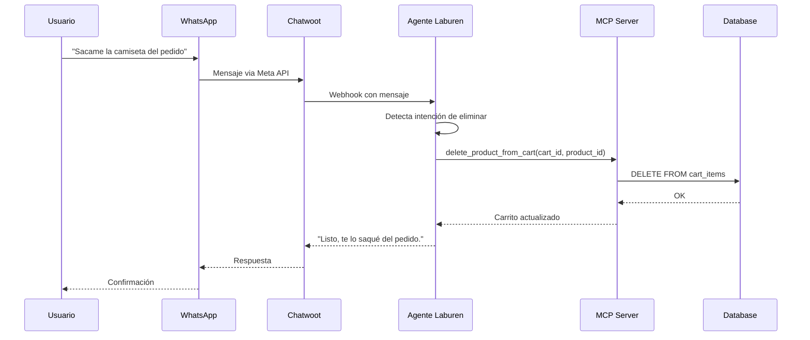
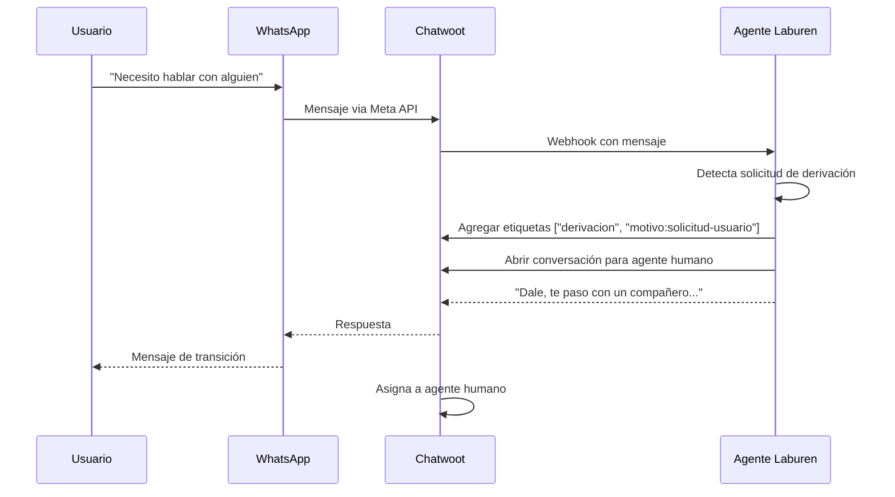
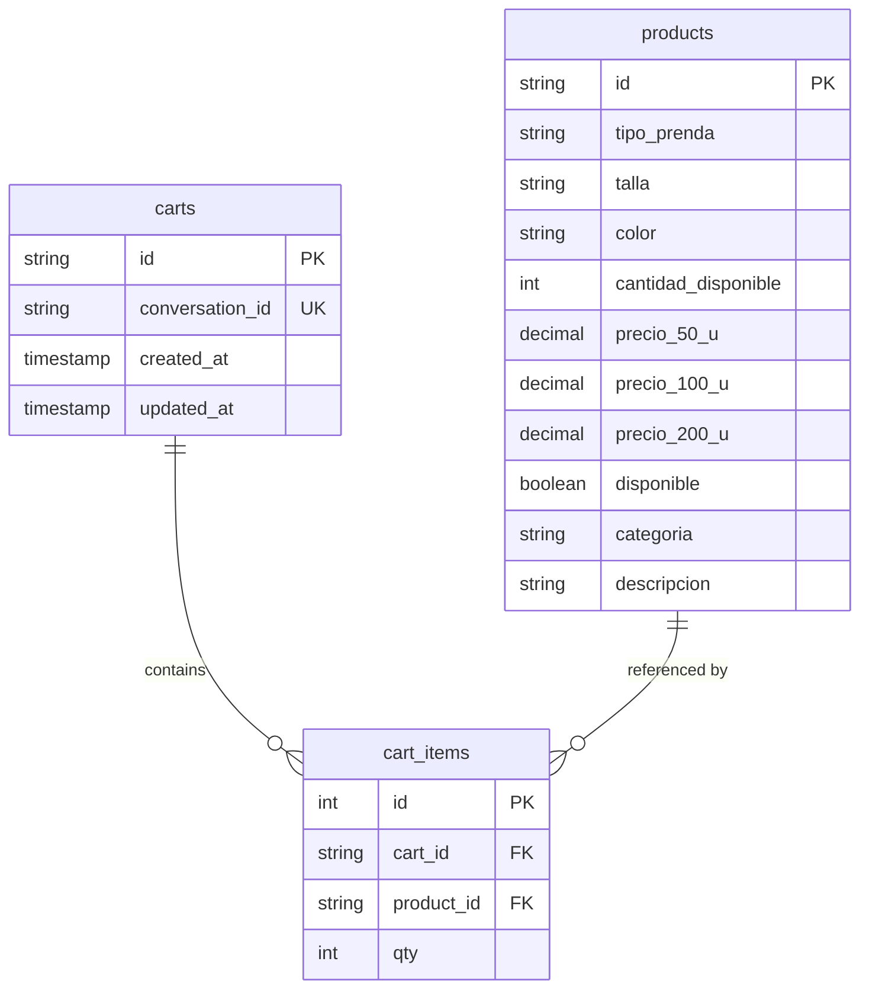

# Diseño del Agente y Flujo de Interacción MCP

## Arquitectura General




---

## Endpoints MCP Disponibles

| Tool MCP | Descripción | Parámetros | Requerido |
|:---------|:------------|:-----------|:---------:|
| `list_products` | Buscar productos con FTS5 y filtros | `query?`, `categoria?`, `talla?`, `color?`, `precio_max?` | ✅ |
| `create_cart` | Crear carrito vinculado a la conversación | `conversation_id` | ✅ |
| `add_products_to_cart` | Agregar o actualizar productos en el carrito | `cart_id`, `product_id`, `qty` (min: 1) | ✅ |
| `delete_product_from_cart` | Eliminar un producto del carrito | `cart_id`, `product_id` | ✅ |
| `view_cart` | Consultar carrito sin modificar | `cart_id` | ⭐ Extra |

> ⚠️ `add_products_to_cart`, `delete_product_from_cart` y `create_cart` devuelven el estado completo del carrito en la respuesta, por lo que `view_cart` solo es necesario si se quiere consultar sin modificar.

### Endpoint de Producción (Cloudflare)

```
https://laburen-asistente-ventas-mcp-server.mauricioarcez23.workers.dev/sse
```

> **Auth:** Requiere header `Authorization: Bearer <tu-token>`

---

## Diagramas de secuencia según caso de uso

### 1. Exploración de Productos



### 2. Agregar Producto al Pedido



### 3. Eliminar Producto del Pedido



### 4. Derivación a Humano



---

## Modelo de Datos



---

## Estrategia de Búsqueda (FTS5)

El sistema utiliza **SQLite FTS5 (Full-Text Search)** para búsquedas eficientes sin necesidad de vector database.

### Columnas indexadas

La tabla virtual `products_fts` indexa **4 columnas**:

| Columna | Ejemplo de valores | Uso en query |
|:--------|:-------------------|:-------------|
| `tipo_prenda` | Camisa, Camiseta, Pantalón | `camisa`, `(camisa OR camiseta)` |
| `color` | Verde, Azul, Negro | `(verde OR "verde agua")` |
| `categoria` | Deportivo, Casual, Formal | `deportivo` |
| `descripcion` | "Ideal para uso diario" | `(diario OR casual)` |

### Extensibilidad

El FTS5 busca sobre **todas las columnas indexadas**, no solo `tipo_prenda`. Esto significa que:

- **Nuevos colores**: Si se agrega un producto con color "Verde Agua", el agente puede encontrarlo con `query="(verde OR \"verde agua\")"` sin cambiar código.
- **Nuevas categorías**: Si se agrega una categoría "Urbano", el agente puede buscar `query="urbano"` inmediatamente.
- **Nuevas descripciones**: Cualquier texto en `descripcion` es buscable al instante.

Los filtros enum (`color`, `categoria`, `talla`) son **atajos de conveniencia** para valores conocidos. El FTS5 es el **fallback universal** para cualquier valor que no esté en los enums hardcodeados.

### Flujo de búsqueda

1. **Agente (Inteligencia)**:
   - Expande sinónimos y agrupa conceptos usando sintaxis FTS5.
   - **Protocolo Pre-búsqueda**: Si el pedido es vago, pide contexto antes de consultar.
   - *Usuario:* "pantalones negros para el gym"
   - *Agente:* `query="(pantalón OR jogging OR calza)"`, `categoria="Deportivo"`, `color="Negro"`

2. **MCP (Motor)**:
   - Ejecuta `MATCH '(pantalón OR jogging OR calza)'` en FTS5.
   - Aplica filtros adicionales (`categoria`, `color`, `precio_max`) mediante `WHERE`.

> **Nota**: Los tipos de prenda en la DB están en **singular** (camisa, camiseta, pantalón, etc.). La tool lo documenta explícitamente para que el agente construya las queries correctamente.

---

## Template de System Prompt

El agente utiliza un system prompt estructurado siguiendo practicas de prompt engineering:

```markdown
You are [role] specializing in [domain].

**Your Core Responsibilities:**
1. [Primary responsibility]
2. [Secondary responsibility]
3. [Additional responsibilities...]

**Analysis Process:**
1. [Step one]
2. [Step two]
3. [Step three]

**Quality Standards:**
- [Standard 1]
- [Standard 2]

**Output Format:**
Provide results in this format:
- [What to include]
- [How to structure]

**Edge Cases:**
Handle these situations:
- [Edge case 1]: [How to handle]
- [Edge case 2]: [How to handle]
```

### Aplicación en Nuestro Agente

| Sección | Contenido |
|:--------|:----------|
| **Role** | Vendedor de indumentaria mayorista |
| **Domain** | Cerrar pedidos mayoristas con tono informal y cercano |
| **Core Responsibilities** | Entender necesidad, presentar opciones rentables, guiar hacia el pedido ("bulto cerrado") |
| **Analysis Process** | Identificar intención → Sugerir populares si es vago (Gym->Deportivo) → Presentar opciones → Armar pedido |
| **Quality Standards** | Tono humano argentino, voseo, respuestas cortas, beneficios > specs, sin presión |
| **Output Format** | Lista conversacional de productos ("Mirá lo que te separé") + pregunta de cierre suave |
| **Edge Cases** | Off-topic (responder breve), usuario indeciso (sugerir populares), sin stock (alternativa), frustrado (calmar) |
| **Domain Knowledge** | Contexto mayorista, tipos/talles/colores válidos, mapeo de términos (buzo->sudadera) |
| **Search Strategy** | Mapeo de términos obligatorio, Gym=Deportivo, manejo de colores ambiguos en query |

> 📄 Ver implementación completa en [`prompts/system-prompt.md`](../prompts/system-prompt.md)

---

## Reglas de Comportamiento del Agente

| Regla | Descripción |
|:------|:------------|
| **Lenguaje** | Argentino ESTRICTO (Buzo, Campera, Remera, Talle). NUNCA "Sudadera" o "Filtrar". |
| **Límite de opciones** | Máximo 3 productos por búsqueda |
| **Sin datos inventados** | Todo debe venir del MCP |
| **Off-topic** | Responde brevemente sin romper el rol |
| **Etiquetas CRM** | Agrega etiquetas al agregar productos o derivar |

---

## Configuración Laburen Dashboard

### Actions Habilitadas

| Action | Estado |
|:-------|:-------|
| MCP Conexión | ✅ Activo |
| Redirección a humano/operador | ✅ Activo |

### Funciones

| Función | Estado | Motivo |
|:--------|:------:|:-------|
| Solo responder con información cargada | ❌ | No aplica, empeora la respuesta |
| Respuestas más claras y legibles | ❌ | Interfiere con el system prompt |
| Responder en idioma del cliente | ❌[Optional] | Simula experiencia humana dedicada al idioma de la tienda |
| Conversación natural en varios mensajes | ✅ | Procesamiento cada 5s, máx 5 msgs/lote, agrupación inteligente |
| Evaluación de fragmentos de texto | ❌ | No necesario |
| Acceso a datos del cliente | ✅ | Contexto para personalización |
| Sistema de búsqueda de conocimientos (RAG) | ❌ | Usamos MCP, no RAG |
| Enviar email en nueva conversación | ❌ | No necesario |
| Mensajes de seguimiento automáticos | ❌ | Costos Meta API para iniciar mensaje |
| Búsqueda súper inteligente | ❌ | Usamos MCP, no RAG |

---

## Stack Tecnológico

| Componente | Tecnología |
|:-----------|:-----------|
| Canal | WhatsApp (Meta API) |
| CRM | Chatwoot |
| Agente | Laburen Dashboard |
| MCP Server | Cloudflare Workers (TypeScript) + Durable Objects |
| Base de Datos | Cloudflare D1 (SQLite + FTS5) |
